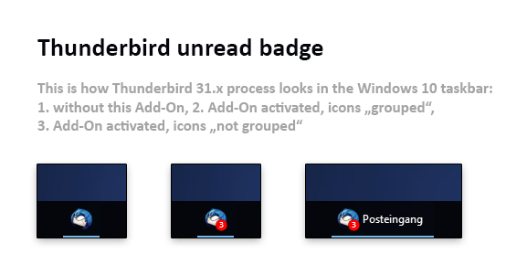

# thunderbird-unread-badge

This is a simple Thunderbird extension for displaying an unread mail message count
on the Windows 10 taskbar. Also works with older versions of Windows (but might look different).

### How does it look ?

### Requirements

This add-on works perfectly with Thunderbird 31.x and older, but breaks with Thunderbird 38.x and newer (versions between 31 and
38 have never been released to public by the way). Reason is that Mozilla has changed the way the application handles icon overlays.
As there are no big differences between v31 and v38 I can recommend to simply install v31 ([find it here on offical Mozilla servers](https://ftp.mozilla.org/pub/thunderbird/releases/))
directly over your current installation, I've done this several times and didn't lost anything. To be on the safe side, make a backup with
[MozBackup](http://mozbackup.jasnapaka.com/) before.

Make sure you deactivate "automatic updates" inside Thunderbird then.

### How to install

Download this repo, unzip it, open Thunderbird, go to *Extras > Add-Ons* and click *Install Add-On from file* from within
the menu behind the cogwheel icon in the upper right, and select the .xpi file. Done! To test simply mark some emails as unread, the badge will instantly show up.

### Story of the project

Thunderbird is one of the best and most used mail applications in the world, 25.000.000+ installations all over the world,
80% of them on Windows 7/8/10 machines. What always freaked me out is that all these millions of people don't get
informed when they have new mail, while showing the amount of new mails/messages/etc. on the icon itself
is standard on OSX, most Linux OS, Android, iOS etc. for years. There are thousands of Add-Ons for every weird
use-case, but none that works to simply show the amount of new mails, and lots of requests to implement this into
the Thunderbird core have been ignored forever. Insane!

However, in early 2016 I stumpled upon the awesome work of [Brandon Streiff](https://github.com/bstreiff),
who created [a simple, excellent unread email badge for Thunderbird add-on](https://github.com/bstreiff/unread-badge)
back in 2014. As this add-on works perfectly with Thunderbird 31.x and older, but is broken with current versions (38.x+),
I would like to attract some developers with this fork to fix this issue and make this add-on awesome again!
Feel free to commit to the project, leave Brandon a tip or push the Mozilla crew to fix the bugs!

### What's different to the original project ?

I've just simplified the badge look a little bit (to fit with the Windows 10 flat look) and removed unused code from
the .js script. You'll find the original version in the original repo for sure.

### How to take part in development

This add-on comes as an .xpi file, which is just a renamed .zip file that holds the files *bootstrap.js*,
*chrome.manifest*, *install.rdf*, **LICENSE.md* and *README.md*. So this add-on is basically just a little
piece of JavaScript. When you change something inside the .js file, just repack these files (without any folders!)
to xxxx.xpi again and install it via Thunderbird to see the changes.

### Why is it not working in latest Thunderbird 38.x ?

[taken from original repo] The Mozilla core
[supports setting the overlay](https://bugzilla.mozilla.org/show_bug.cgi?id=515907),
but the [bug for actually making Thunderbird do so](https://bugzilla.mozilla.org/show_bug.cgi?id=494137)
has languished for about four years. Sigh.

### What needs to be done ?

- make it work with latest Thunderbird versions again
- make it work with "small taskbar" in Windows 10, currently it doesn't show anything on small taskbars
- works fine for small numbers, but looks weird for "wide" numbers grous like 99 and higher
- maybe some configs, like colors, size, font-size etc.
- maybe get in contact with Brandon from original project when things are fixed

### Big thanks

A big thanks to the original repo creator, this is awesome work! I really don't know why this add-on it's used by
much much muchmore people ...

### Troubleshooting

The big "anniversary update" for Windows 10 (Build 1607), released in August 2016, might affect Thunderbird plugins. So in case you don't see the badge anymore, just deactivate add-on, restart Thunderbird and then reactive the add-on.

Also, when your mail account is too full or full of folders, the counter might get confused and stop working. Delete the stuff in the trashcan and restart Thunderbird to fix this.
